<div align="center">



<br />

[](https://omerulaskara.github.io)
[](mailto:contact@ulaskara.dev)
[](https://instagram.com/ulaskaara)

</div>

<br />

```bash
ulaskara@studio ❯ cat about.md
```

> A developer who designs systems end-to-end and **ships them to production**.
> Legal Tech, WebRTC call centers, real-time mobile products, and RAG search infrastructure.

<br />

```bash
ulaskara@studio ❯ stats --portfolio --format=table
```

| 🗂️ Repositories | 🔗 Active endpoints | 🚀 Sprints shipped | 🔌 3rd-party services |
| :-: | :-: | :-: | :-: |
| **17** | **14** | **19** | **10+** |
| 9 legal · 1 SaaS · 2 mobile · 5 utils | UYAP case-filing flow | call-center-platform, live | Asterisk · Supabase · OpenAI · Sentry |

<br />

```bash
ulaskara@studio ❯ cat domains.json
```

```json
{
  "01_legal_tech":  { "category": "UYAP Ecosystem",       "depth": "8+ production projects" },
  "02_telephony":   { "category": "Contact Center",       "stack":  "Asterisk 20 · sip.js · WebRTC" },
  "03_mobile":      { "category": "Social & Realtime",    "stack":  "RN 0.76 · Expo 54 · Skia 2.2" },
  "04_ai_rag":      { "category": "IR · Data Pipeline",   "stack":  "BM25 + Vector · FastAPI · Eval" }
}
```

<br />

```bash
ulaskara@studio ❯ git log --featured --oneline -n 6
```

| Hash | Project | Tag | Status |
| :-: | :-- | :-- | :-: |
| `c0ffee1` | **[call-center-platform](https://github.com/omerulaskara)** — Multi-tenant WebRTC call center | `SaaS · Multi-tenant` | 🟢 [live](https://ccp.stroke-app.com) |
| `a11ce42` | **[stroke](https://github.com/omerulaskara)** — Event-sourced social art network | `Mobile + Web · Consumer` | 🟢 [live](https://stroke-app.com) |
| `deadbef` | **[icra-ceza-otomasyon](https://github.com/omerulaskara)** — 14-endpoint UYAP automation | `Desktop · Legal Tech` | 🟢 prod |
| `1234567` | **[ictihat-motoru](https://github.com/omerulaskara)** — BM25 + vector RAG search | `AI · Search · RAG` | 🟢 prod |
| `abc4567` | **[culture-line](https://github.com/omerulaskara)** — Realtime multiplayer trivia | `Mobile · Multiplayer` | 🟡 staging |
| `fedcba9` | **[pusula-dava](https://github.com/omerulaskara)** — XHR case robot + Laravel panel | `Web · Legal Tech` | 🟢 prod |

<br />

```bash
ulaskara@studio ❯ cat package.json | jq .dependencies
```

<p>
  
  
  
  
</p>
<p>
  
  
  
  
  
</p>
<p>
  
  
  
  
</p>
<p>
  
  
  
  
</p>
<p>
  
  
  
  
  
</p>
<p>
  
  
  
  
  
</p>

<br />

```bash
ulaskara@studio ❯ tree architecture/ -L 2
```

```
architecture/
│
├── EDGE/
│   ├── Caddy 2
│   ├── Let's Encrypt
│   ├── Cloudflare DNS
│   └── Vercel Edge
│
├── FRONTEND/
│   ├── React 18 + Vite
│   ├── Mantine 7
│   ├── TanStack Query
│   ├── Zustand
│   └── sip.js softphone
│
├── API/
│   ├── NestJS 11
│   ├── JWT + MFA TOTP
│   ├── RBAC + X-Project-Id
│   ├── Audit interceptor
│   └── Swagger doc
│
├── WORKERS/
│   ├── BullMQ
│   ├── Predictive dialer
│   ├── Excel import
│   └── Post-call processor
│
├── REALTIME/
│   ├── Socket.IO
│   ├── Asterisk ARI/Stasis
│   ├── Channel state
│   └── Wallboard
│
├── DATA/
│   ├── PostgreSQL 15
│   ├── Prisma 5
│   ├── Redis 7
│   └── MinIO call recording
│
└── OBSERVABILITY/
    ├── Sentry
    ├── JSONL access log
    ├── System Health dashboard
    └── Backup cron · RUNBOOK.md
```

<br />

```bash
ulaskara@studio ❯ cat security.config.yaml
```

```yaml
security:
  - argon2id_password_hash:    "GPU/ASIC-resistant; preferred over bcrypt"
  - jwt_15m_7d_refresh:        "Short-lived access + rotational refresh"
  - mfa_totp_aes_gcm:          "otplib + qrcode + encrypted-at-rest secret"
  - brute_force_lock:          "Redis counter; lock after 6 failed attempts"
  - audit_log_interceptor:     "All POST/PATCH/DELETE auto-logged + filterable"
  - rls_double_layer:          "Supabase RLS + DB trigger self-report blocking"
  - login_history_ip_ua:       "Sessions + attempts visible w/ IP + user agent"
  - backup_cron_runbook:       "Daily PG + MinIO backup; ops/RUNBOOK.md"
  - healthcheck_wallboard:     "/health/live + live System Health dashboard"
```

<br />

```bash
ulaskara@studio ❯ cat contact.vcf
```

```vcard
BEGIN:VCARD
VERSION:4.0
FN:Ömer Ulaş Kara
TITLE:Senior Full-Stack Developer · Founding Developer
ADR:Istanbul, Türkiye
URL:https://omerulaskara.github.io
X-GITHUB:@omerulaskara
X-INSTAGRAM:@ulaskaara
TEL:+90 532 156 94 06
END:VCARD
```

<br />

<div align="center">

```bash
ulaskara@studio ❯ █
```

<sub>**[▸ Open the full interactive portfolio →](https://omerulaskara.github.io)**</sub>

<br />

<sub>© 2026 Ömer Ulaş Kara · Istanbul · Designed & coded · v2.0 — Terminal Edition</sub>

</div>
